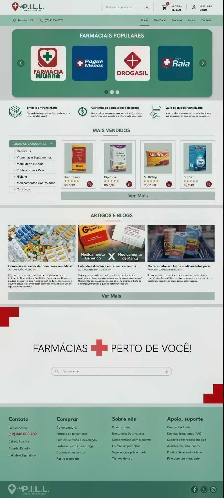

# 💊 Farmácia P.I.L.L.

> A Pill é uma plataforma que reúne farmácias parceiras para oferecer medicamentos com preços competitivos, facilitando a compra, a localização de estabelecimentos próximos e o acompanhamento personalizado do tratamento dos usuários.

### Ajustes e melhorias

O projeto ainda está em desenvolvimento e as próximas atualizações serão voltadas para as seguintes tarefas:

- [ ] Desenvolvimento da estrutura HTML da página

## 🤝 Colaboradores

Agradecemos às seguintes pessoas que contribuíram para este projeto:

<table>
  <tr>
    <td align="center">
      <a href="https://www.github.com/Isabelvitoriano" title="Designer e Desenvolvedora">
         
        
          <b>Isabel Vitoriano</b>
        
      </a>
    </td>
    <td align="center">
      <a href="https://www.github.com/analeshh" title="Líder e Gestora de Negócios">
         
        
          <b>Leticia Chimenes</b>
        
      </a>
    </td>
    <td align="center">
      <a href="https://www.github.com/raphimw2e" title="Suporte de Design e Analista de Dados">
         
        
          <b>Rafaela de Araújo</b>
        
      </a>
    </td>
    <td align="center">
      <a href="https://www.github.com/dev-jpaulo" title="Idealizador do Projeto">
         
        
          <b>João Paulo de Holanda</b>
        
      </a>
    </td>
    <td align="center">
      <a href="https://www.github.com/fefter" title="Pesquisadora e Analista de Dados">
         
        
          <b>Fernanda Pinheiro</b>
        
      </a>
    </td>
    <td align="center">
      <a href="https://www.github.com/Error-710" title="Pesquisador e Desenvolvedor">
         
        
          <b>Renan Mesquita Brasil</b>
        
      </a>
    </td>
  </tr>
</table>

